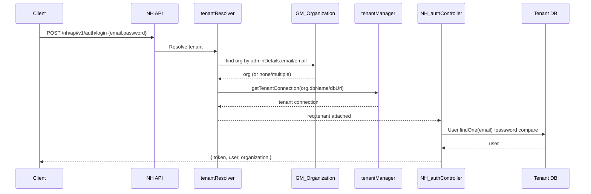

# Architecture Document
## Vital Health Hub

Version: 3.0  
Date: March 6, 2026

## 1. System Overview
Vital Health Hub uses a hub-and-spoke multi-tenant architecture:
- Hub: Grandmaster control plane (platform DB)
- Spokes: Tenant hospital workloads (one DB per organization)

## 2. High-Level Architecture
```mermaid
flowchart TB
  U1[Grandmaster User] --> FE[React SPA]
  U2[Hospital User] --> FE

  FE --> GMAPI[/gm/api/v1]
  FE --> NHAPI[/nh/api/v1]

  GMAPI --> GMCTRL[GM Controllers]
  NHAPI --> NHMW[Tenant Resolver + Auth + RBAC]
  NHMW --> NHCTRL[NH Controllers]

  GMCTRL --> GMDB[(Platform DB)]
  NHCTRL --> TM[Tenant Connection Manager]
  TM --> TDB1[(Tenant DB A)]
  TM --> TDB2[(Tenant DB B)]
  TM --> TDBN[(Tenant DB N)]
```

## 3. Runtime Components
### 3.1 Backend Layers
- `server.js`: bootstraps middleware, routes, DB connection.
- `routes/index.js`: mounts NH and GM namespaces.
- `middleware/tenantResolver.js`: resolves tenant context.
- `middleware/auth.js`: JWT authentication + role and visual access authorization.
- `config/tenantManager.js`: tenant DB connection pooling and model registration.

### 3.2 Data Layer Strategy
- Platform data in base DB (`MONGODB_URI`): organizations, subscriptions, GM users.
- Tenant data in separate DB per org (`nh_tenant_<slug>` or custom `dbUri`).

## 4. Tenant Resolution Design
### 4.1 Resolution Priority
1. `x-org-slug` request header
2. Subdomain slug (e.g., `acme.example.com` -> `acme`)
3. `POST /auth/login` email lookup in `GM_Organization` (admin/contact email)

### 4.2 Failure Behavior
- Unknown explicit slug: `404`
- Suspended organization: `403`
- Multiple organizations matching login email: `409`
- No hint/no match: continue without tenant for backward compatibility

## 5. Authentication Architecture
### 5.1 NH Login
- Controller uses tenant-aware model resolution (`getModel(req, 'User', BaseUser)`).
- Login response now includes `organization` metadata.
- Frontend stores `organization.slug` for future API calls.

### 5.2 NH Authenticated Calls
- API client sends:
  - `Authorization: Bearer <token>`
  - `x-org-slug: <resolved-slug>`
- Tenant resolver binds request to tenant connection before controller execution.

## 6. Authorization Architecture
- Role hierarchy (`super_admin` > `hospital_admin` > others as configured).
- `authorizeRoles(...)` middleware includes visual-access override checks.
- Visual access settings are cached for short TTL for performance.

## 7. Sequence: Tenant-Aware Login (Current)


## 8. Key Strengths
- Strong tenant data isolation via DB-per-tenant.
- Connection reuse and lazy tenant connection creation.
- Backward compatibility maintained for explicit slug/subdomain routing.

## 9. Known Architectural Risks
- Tenant email lookup currently scoped to login endpoint only.
- Passport strategies remain in codebase as secondary/legacy path.

## 10. Recommended Next Refactors
1. Extend email-based tenant resolution safely to forgot-password flow.
2. Add tenant id/slug claim in JWT to reduce dependency on request headers.
3. Add integration tests for tenant routing and auth edge cases.
4. Add integration tests for tenant isolation of settings/data-management flows.
