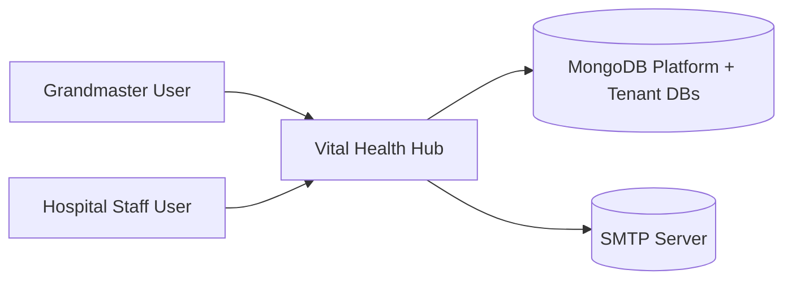
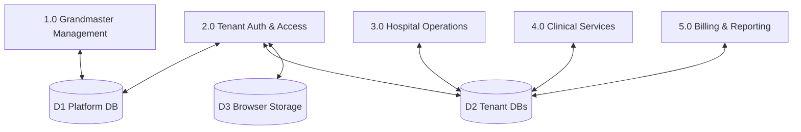
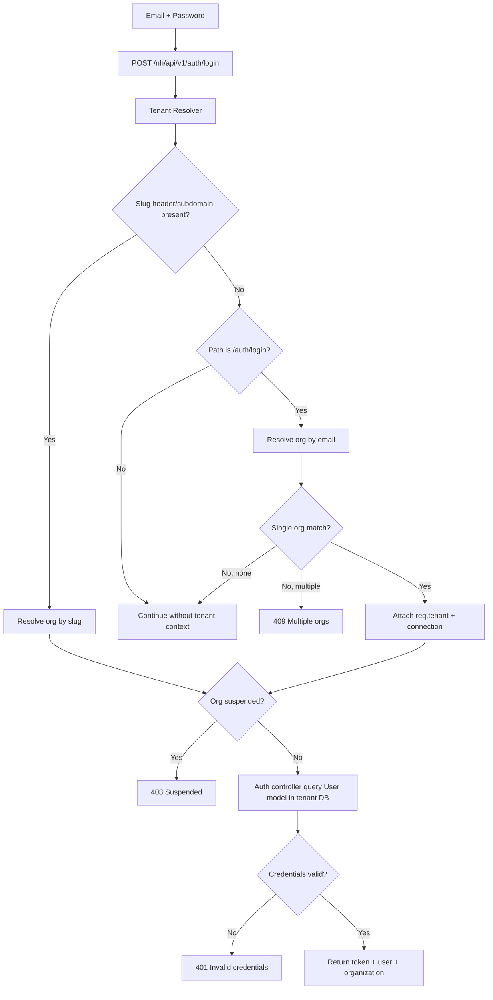
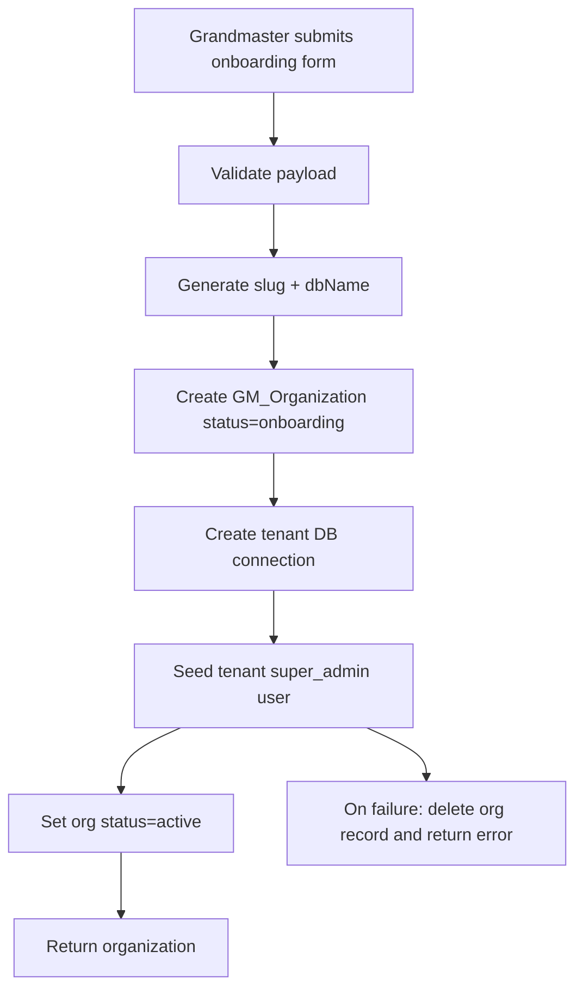

# Data Flow Diagrams (DFD)
## Vital Health Hub

Version: 3.0  
Date: March 6, 2026

## 1. Level 0 (Context Diagram)


## 2. Level 1 (Major Processes)


## 3. Level 2: Tenant-Aware Login


## 4. Level 2: Authenticated NH Request
```mermaid
flowchart TD
  R1[Client request with Bearer token + x-org-slug] --> R2[Tenant Resolver]
  R2 --> R3[Attach req.tenantConn]
  R3 --> R4[authenticate middleware]
  R4 --> R5[authorize middleware]
  R5 --> R6[NH controller via getModel(req,...)]
  R6 --> R7[(Tenant DB)]
  R7 --> R8[Response]
```

## 5. Level 2: Organization Onboarding


## 6. Data Stores
- D1 Platform DB:
  - `GM_Organization`, `GM_Subscription`, `GM_SubscriptionPlan`, `GM_GrandmasterUser`, etc.
- D2 Tenant DB(s):
  - `User`, `Patient`, `Admission`, `Bed`, `Invoice`, `LabTest`, `Prescription`, etc.
- D3 Browser storage:
  - `token`, `user`, `org_slug`.

## 7. Integrity Notes
- Tenant context must be established before NH model resolution.
- Missing/incorrect tenant context can cause default DB reads/writes.
- Settings and data-management flows now use tenant-bound models; keep regression tests to prevent fallback to default DB models.
