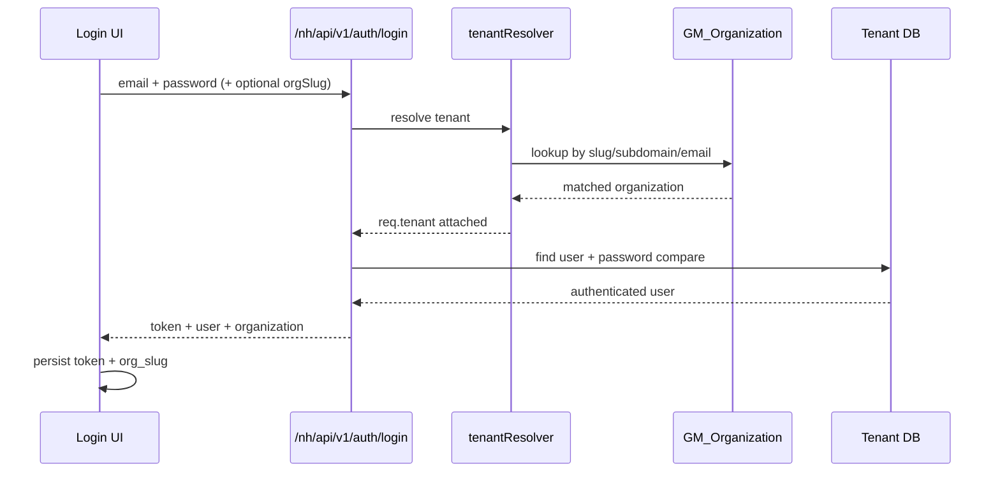

# Tenant-Aware Login Analysis and Bug Hunt
## Vital Health Hub

Version: 2.0  
Date: March 6, 2026  
Status: Updated after implementation patch

## 1. Objective
Analyze whether hospital admin login through `/login` correctly auto-connects to tenant DB based on email, identify breakpoints, and document applied fix plus remaining risks.

## 2. Root Problem (Before Patch)
### Observed Behavior
- `/nh/api/v1/auth/login` depended on `req.tenant` to query tenant `User` model.
- `req.tenant` was only set via:
  - `x-org-slug` header, or
  - subdomain slug.
- If user logged in from plain `/login` without slug/subdomain, request often hit default DB and tenant user was not found.

### Secondary Break
- Even if login could be resolved once, frontend did not persist server-resolved tenant slug.
- Subsequent authenticated requests could miss tenant context and fail or route incorrectly.

## 3. Fix Implemented (March 6, 2026)
### 3.1 Backend: Email-Based Tenant Resolution
File: `backend/src/middleware/tenantResolver.js`
- Added email-based tenant lookup for `POST /auth/login` when slug/subdomain is absent.
- Lookup source: `GM_Organization` (`adminDetails.email` and `email`).
- Added ambiguity guard:
  - multiple matches -> `409` with explicit slug guidance.
- Existing status guard retained:
  - suspended org -> `403`.

### 3.2 Backend: Return Organization Context on Login
File: `backend/src/controllers/NH_authController.js`
- `login` response now includes:
  - `organization.id`
  - `organization.name`
  - `organization.slug`
  - `organization.type`
  - `organization.status`
  - `organization.enabledModules`

### 3.3 Frontend: Persist Resolved Tenant Context
File: `src/lib/AuthContext.jsx`
- After login success, persist `organization.slug` (or hinted slug fallback) via `setOrgSlug`.
- Added `removeOrgSlug()` on logout to prevent stale tenant sessions.
- User object stored in local storage now also carries organization metadata when returned.

### 3.4 Frontend: Login UX Clarification
File: `src/pages/Login.jsx`
- Label updated to `Organization Slug (Optional)` with auto-detect hint.

## 4. Current Login Flow (After Patch)

## 5. Validation Performed
- `node --check backend/src/middleware/tenantResolver.js` passed.
- `node --check backend/src/controllers/NH_authController.js` passed.
- `npm run build` (frontend) passed.
- ESLint run completed with warnings that those JSX files are ignored by current ESLint config (no errors).

## 6. Bug Hunt Findings (Open)
### F1 - Resolved (March 6, 2026): Settings Controller Tenant Leakage Risk
- `backend/src/controllers/NH_settingsController.js` now resolves all models through tenant-aware `getModel(req, ...)`.
- Data-management helpers now receive tenant models explicitly.
- Module operations utility was updated to accept tenant model context, and callers pass `req`.

### F2 - Medium: Email Auto-Resolution Scope Limited to Login
- Email-based tenant resolution currently applies to `POST /auth/login` only.
- `forgot-password` still requires slug/subdomain context to guarantee tenant routing.

### F3 - Medium: Ambiguous Email Handling Depends on Data Hygiene
- If same admin/contact email exists in more than one org, login fails with `409` unless explicit slug is provided.
- This is safe behavior, but indicates org email uniqueness policy should be strengthened.

### F4 - Low: Legacy Passport Config Debt
- `config/passport.js` strategies exist but are not the primary middleware path for NH APIs.
- Increases maintenance overhead and confusion.

## 7. Recommendations
1. Extend controlled email-tenant resolution to password-reset initiation.
2. Enforce stronger uniqueness policy on organization admin email.
3. Add integration tests covering:
   - slug routing
   - subdomain routing
   - email auto-resolution
   - ambiguous email conflict path
   - settings/data-management tenant isolation
