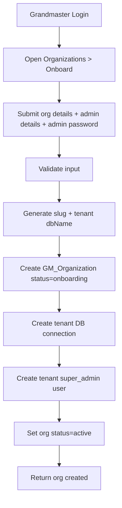
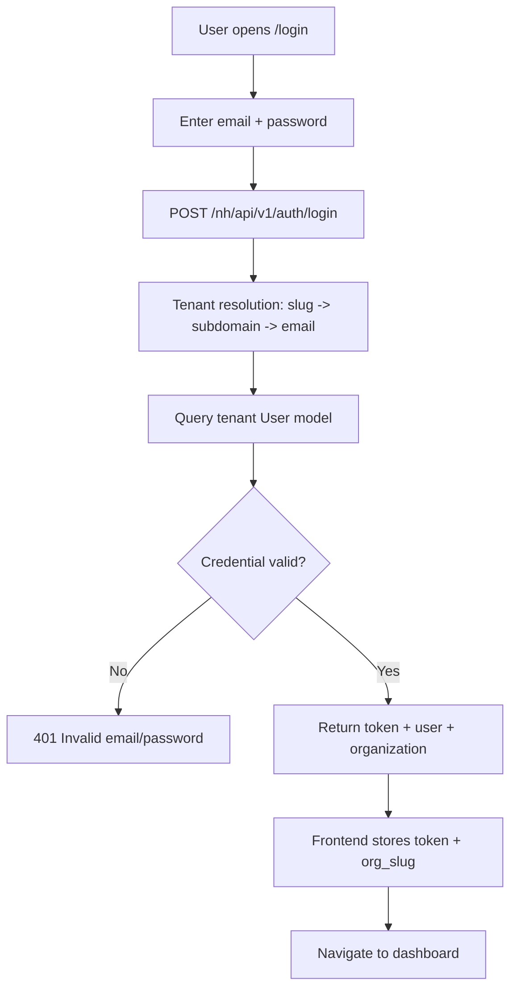
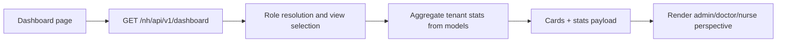
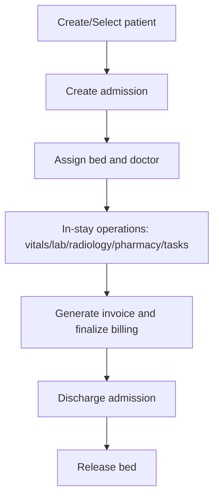
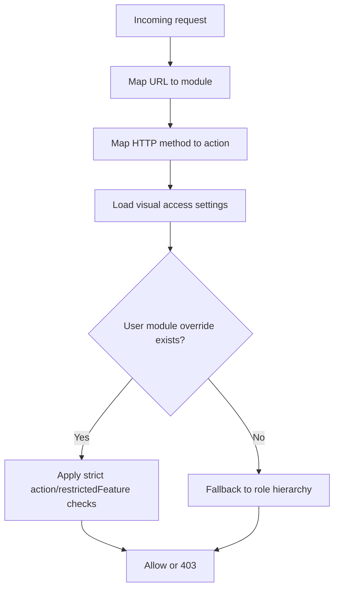
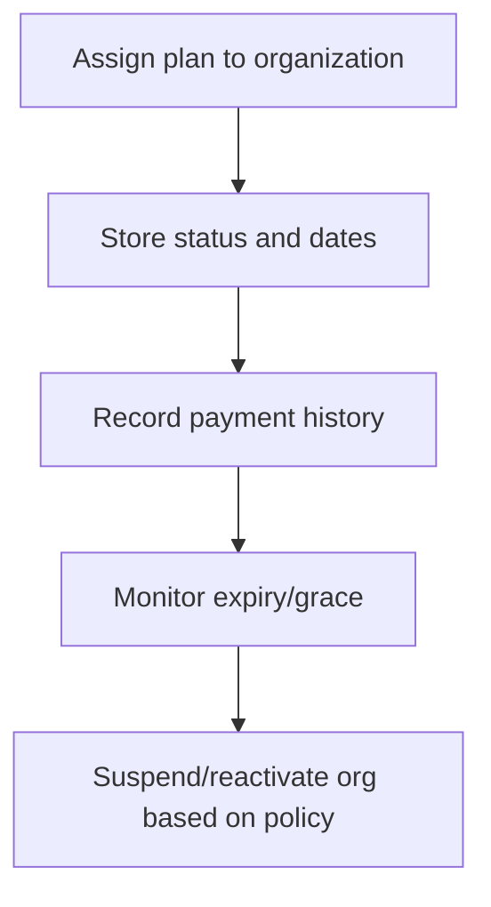

# Operational Flow Diagrams
## Vital Health Hub

Version: 3.0  
Date: March 6, 2026

## 1. End-to-End Tenant Onboarding Flow


## 2. Hospital Login Flow (Current)


## 3. Authenticated API Request Flow
```mermaid
flowchart TD
  A1[Frontend API call] --> A2[Attach Bearer token + x-org-slug]
  A2 --> A3[resolveTenant middleware]
  A3 --> A4[authenticate middleware]
  A4 --> A5[authorize middleware]
  A5 --> A6[Controller uses getModel(req,...)]
  A6 --> A7[Execute against tenant DB]
  A7 --> A8[Return response]
```

## 4. Dashboard Data Flow


## 5. Admission Lifecycle Flow


## 6. Visual Access Permission Flow


## 7. Subscription Impact Flow


## 8. Failure Paths to Monitor
- Tenant ambiguity on login email -> `409`.
- Suspended organization -> `403`.
- Missing/stale `org_slug` on client -> tenant context mismatch.
- Add regression checks to ensure settings/data-management/model-ops paths never regress to default-DB model usage.
